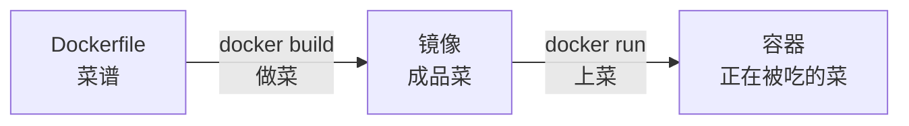

# 02-01 Dockerfile 是什么

## 本节你会学到什么

- 理解 Dockerfile 是什么以及它解决了什么问题
- 掌握镜像构建的基本流程：从 Dockerfile 到镜像到容器
- 理解"基础设施即代码"思想在 Dockerfile 中的体现
- 能够阅读并理解一个简单的 Dockerfile

## 正文

还记得模块 01 里你是怎么用 Docker 的吗？你在终端敲 `docker run nginx`，然后 nginx 就跑起来了。你不需要安装 nginx，不需要配置依赖，一条命令搞定。但你有没想过一个问题：那个 nginx 镜像，是谁做的？怎么做的？

答案就是 Dockerfile。

### 做菜类比

想象你去餐厅吃饭。服务员端上一盘红烧肉，这盘菜就是**镜像**。你把菜吃掉的过程，就是**运行容器**。

但你肯定想知道这盘菜是怎么做出来的吧？后厨一定有一份**菜谱**，上面写着：

```
1. 准备五花肉 500 克
2. 焯水去血沫
3. 炒糖色
4. 加酱油、料酒、八角
5. 小火慢炖 40 分钟
6. 出锅装盘
```

菜谱就是 Dockerfile。照着菜谱一步步做菜的过程，就是 `docker build`。做出来的成品菜，就是镜像。食客点菜上菜的过程，就是 `docker run` 启动容器。

所以一句话：**Dockerfile 是镜像的"菜谱"，是一份文本文件，告诉 Docker 怎么一步步构建出你想要的镜像。**

### 为什么需要 Dockerfile

没有 Dockerfile，你的镜像就是一个"黑盒"。别人不知道里面装了什么东西，怎么装的，出了问题也没法排查。更关键的是：你自己下次想重新做一个一模一样的镜像，你还能记住所有步骤吗？

Dockerfile 的价值就在于**可重复、可分享、可审计**。



把环境配置写成代码，这就是"基础设施即代码"（Infrastructure as Code）思想。Dockerfile 就是这种思想在容器领域的实践。你的开发环境、测试环境、生产环境，用的都是同一份 Dockerfile 构建出的镜像，自然就不会出现"我机器上能跑啊"这种经典甩锅语录了。

### 一个最简 Dockerfile

先看一个最简单的例子，感受一下：

```dockerfile
FROM alpine:3.20
RUN echo "Hello, Docker!" > /message.txt
CMD cat /message.txt
```

这个 Dockerfile 一共三行，做的事情是：

1. **FROM**：拿一个 alpine 作为"底料"——一个迷你 Linux。
2. **RUN**：在镜像里执行一条命令，写了一个文件。
3. **CMD**：设定镜像启动时默认执行的命令——把那个文件的内容打印出来。

构建并运行试试：

```bash
# 在 Dockerfile 所在目录执行
docker build -t my-first-image .
docker run my-first-image
# 输出: Hello, Docker!
```

### 构建过程的直观理解

`docker build` 时，Docker 会一行一行地执行你的 Dockerfile。每一行指令（FROM、RUN、COPY 等）都会产生一个"镜像层"。Docker 把这些层叠加起来，最终形成完整的镜像。

打个比方：盖一个多层蛋糕。第一层（FROM）是蛋糕胚，第二层（RUN）铺一层奶油，第三层（COPY）放水果，第四层（CMD）最后撒一层糖粉。`docker build` 就是从下往上一层一层往上盖。最终你得到的就是一个叠好的蛋糕——镜像。每层之间是独立的，如果你改了第三层，前两层可以复用不用重做。

这个"层"的概念非常重要，它直接影响构建速度和镜像大小，我们在 02-03 和 02-09 中会详细讲。

### Dockerfile 的核心指令速览

Dockerfile 的指令不多，常用的就十几个。这里先给你一个表格，让你心里有数：

| 指令 | 作用 | 使用频率 |
|------|------|---------|
| FROM | 指定基础镜像 | 必用 |
| RUN | 在构建时执行命令 | 高频 |
| COPY | 把文件从宿主机复制到镜像 | 高频 |
| CMD | 容器启动时的默认命令 | 必用 |
| ENTRYPOINT | 容器入口程序 | 高频 |
| WORKDIR | 设置工作目录 | 高频 |
| ENV | 设置环境变量 | 中频 |
| EXPOSE | 声明容器监听的端口 | 中频 |
| ARG | 构建参数 | 中频 |

别怕，我们会用接下来 9 节内容把这些指令一个一个吃透。

## 动手试试

找一个空目录，把上面那个三行的 Dockerfile 写进去，执行 `docker build -t my-first-image .` 然后 `docker run my-first-image`。确认你能看到 "Hello, Docker!" 的输出。然后试着把 `echo "Hello, Docker!"` 改成你自己的话，重新构建再跑一次。

## 本节小结

Dockerfile 是镜像的"菜谱"，`docker build` 是"做菜"的过程，镜像就是"成品菜"。每个指令产生一个镜像层，层层叠加形成最终镜像。

## 下一节预告

下一节我们学习 FROM 指令——如何选择合适的基础镜像，alpine、slim、完整版各有什么优劣。
